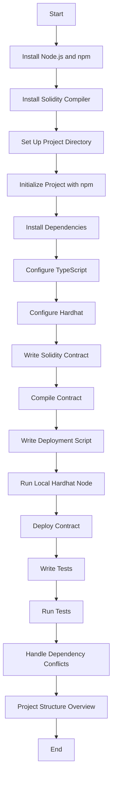
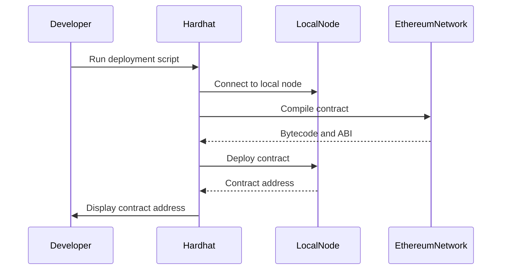
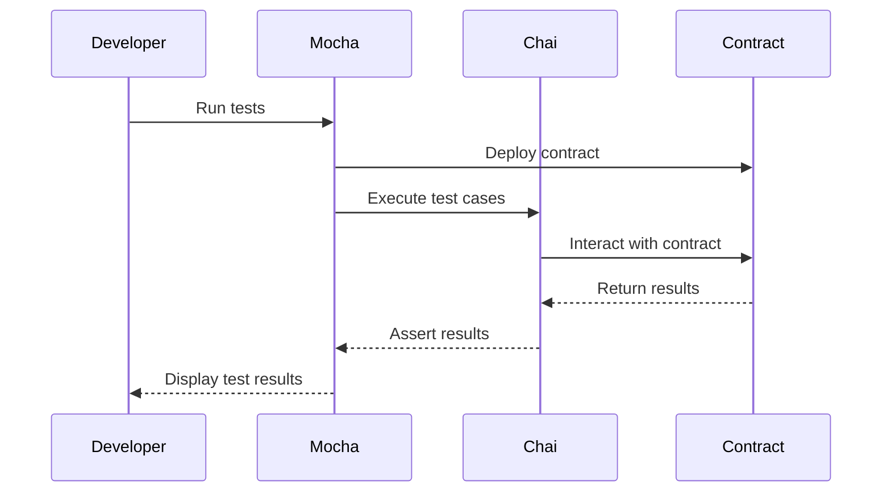

# Comprehensive Guide: Building, Deploying, and Testing a Solidity Smart Contract on Windows 11 Pro Using Hardhat, TypeScript, Viem, Mocha, and Chai

This guide will walk you through setting up a Solidity project from scratch

---

## Table of Contents

1. [Prerequisites](#1-prerequisites)
2. [Installing Node.js and npm](#2-installing-nodejs-and-npm)
3. [Installing Solidity Compiler](#3-installing-solidity-compiler)
4. [Setting Up the Project Directory](#4-setting-up-the-project-directory)
5. [Initializing the Project](#5-initializing-the-project)
6. [Installing Dependencies](#6-installing-dependencies)
7. [Configuring TypeScript](#7-configuring-typescript)
8. [Configuring Hardhat](#8-configuring-hardhat)
9. [Writing the Solidity Contract](#9-writing-the-solidity-contract)
10. [Compiling the Contract](#10-compiling-the-contract)
11. [Writing the Deployment Script](#11-writing-the-deployment-script)
12. [Running a Local Hardhat Node](#12-running-a-local-hardhat-node)
13. [Deploying the Contract](#13-deploying-the-contract)
14. [Writing Tests with Mocha and Chai](#14-writing-tests-with-mocha-and-chai)
15. [Running the Tests](#15-running-the-tests)
16. [Handling Dependency Conflicts](#16-handling-dependency-conflicts)
17. [Project Structure Overview](#17-project-structure-overview)
18. [Conclusion](#18-conclusion)

---

## 1. Prerequisites

Before you begin, ensure you have the following installed on your system:

- **Node.js** (version 14 or higher)
- **npm** (comes with Node.js)
- **Git** (optional but recommended)

---

## 2. Installing Node.js and npm

**Node.js** is required to run JavaScript outside of a browser and to use npm, which manages project dependencies.

### Steps

1. **Download Node.js:**

   - Visit the [Node.js official website](https://nodejs.org/en/download/).
   - Download the **LTS (Long Term Support)** version for Windows.
   - Run the installer and follow the prompts to complete the installation.

2. **Verify Installation:**

   Open **PowerShell** and run:

   ```powershell
   node -v
   npm -v
   ```

   You should see the versions of Node.js and npm installed.

---

## 3. Installing Solidity Compiler

The Solidity compiler (`solc`) is necessary to compile your Solidity contracts.

### Steps

1. **Install `solc` via npm:**

   ```powershell
   npm install -g solc
   ```

2. **Verify Installation:**

   ```powershell
   solcjs --version
   ```

   You should see the version of the Solidity compiler installed.

---

## 4. Setting Up the Project Directory

Create a new directory for your Solidity project. You can name it anything you like. For this guide, we'll call it `solidity_tuts`.

### Steps

1. **Create the Project Directory:**

   ```powershell
   mkdir solidity_tuts
   cd solidity_tuts
   ```

2. **Open in Visual Studio Code (optional but recommended):**

   ```powershell
   code .
   ```

   This will open the current directory in VS Code.

---

## 5. Initializing the Project

Initialize the project with npm. This will create a `package.json` file to manage your project dependencies.

### Steps

```powershell
npm init -y
```

---

## 6. Installing Dependencies

We will install all the necessary dependencies required for our project, ensuring compatibility and handling any potential conflicts.

### Install Hardhat

```powershell
npm install --save-dev hardhat
```

### Initialize Hardhat

```powershell
npx hardhat
```

- When prompted, select **Create a TypeScript project**.
- Accept the default values for the project structure.
- Hardhat will create several files and directories, including `hardhat.config.ts`.

### Install TypeScript and ts-node

```powershell
npm install --save-dev typescript ts-node @types/node
```

### Install Ethers.js and Viem

```powershell
npm install --save-dev ethers@5.7.2 viem@2.21.22
```

> **Note:** We're using `ethers@5.7.2` because Hardhat's ethers plugin is compatible with version 5.

### Install Hardhat Plugins

```powershell
npm install --save-dev @nomiclabs/hardhat-ethers@2.2.3 @nomicfoundation/hardhat-toolbox-viem@3.0.0
```

### Install Mocha and Chai

```powershell
npm install --save-dev mocha chai@4.5.0
```

### Install Type Definitions for Mocha and Chai

```powershell
npm install --save-dev @types/mocha@9.1.0 @types/chai@4.2.0
```

### Install Additional Hardhat Plugins

```powershell
npm install --save-dev @nomicfoundation/hardhat-ignition@^0.15.0 @nomicfoundation/ignition-core@^0.15.0 --legacy-peer-deps
```

> **Note:** Using `--legacy-peer-deps` to handle potential dependency conflicts.

---

## 7. Configuring TypeScript

Create a `tsconfig.json` file to configure TypeScript settings.

### Steps

1. **Initialize TypeScript Configuration:**

   ```powershell
   npx tsc --init
   ```

2. **Modify `tsconfig.json` to include the following settings:**

   ```json
   {
     "compilerOptions": {
       "target": "es6",
       "module": "commonjs",
       "strict": true,
       "esModuleInterop": true,
       "skipLibCheck": true,
       "forceConsistentCasingInFileNames": true,
       "outDir": "./dist"
     },
     "include": ["./scripts", "./test", "./typechain", "./hardhat.config.ts"]
   }
   ```

---

## 8. Configuring Hardhat

Modify the `hardhat.config.ts` file to include necessary plugins and configurations.

### Steps

1. **Open `hardhat.config.ts` and update it as follows:**

   ```typescript
   import { HardhatUserConfig } from "hardhat/config";
   import "@nomicfoundation/hardhat-toolbox-viem";
   import "@nomiclabs/hardhat-ethers";
   import "@nomicfoundation/hardhat-ignition";
   import "@nomicfoundation/hardhat-ignition-viem";
   import "@nomicfoundation/hardhat-network-helpers";
   import "@nomicfoundation/hardhat-verify";
   import "hardhat-gas-reporter";
   import "solidity-coverage";

   const config: HardhatUserConfig = {
     solidity: "0.8.27",
     networks: {
       hardhat: {},
       localhost: {
         url: "http://127.0.0.1:8545",
       },
     },
     gasReporter: {
       enabled: true,
     },
   };

   export default config;
   ```

---

## 9. Writing the Solidity Contract

Create a `contracts` directory and write the `HelloWorld.sol` contract.

### Steps

1. **Create the `contracts` Directory:**

   ```powershell
   mkdir contracts
   ```

2. **Create `HelloWorld.sol` in the `contracts` Directory:**

   ```powershell
   New-Item -Path .\contracts\HelloWorld.sol -ItemType File
   ```

3. **Add the Following Content to `HelloWorld.sol`:**

   ```solidity
   // SPDX-License-Identifier: MIT
   pragma solidity ^0.8.27;

   contract HelloWorld {
       string private greet;

       constructor() {
           greet = "Hello, World!";
       }

       function greetFunction() public view returns (string memory) {
           return greet;
       }

       function setGreet(string memory _greet) public {
           require(bytes(_greet).length > 0, "Greeting cannot be empty");
           greet = _greet;
       }
   }
   ```

---

## 10. Compiling the Contract

Compile your Solidity contract using Hardhat.

### Steps

```powershell
npx hardhat compile
```

You should see an output similar to:

```
Compiled 1 Solidity file successfully (evm target: paris).
```

---

## 11. Writing the Deployment Script

Create a `scripts` directory and write the `deploy.ts` script.

### Steps

1. **Create the `scripts` Directory:**

   ```powershell
   mkdir scripts
   ```

2. **Create `deploy.ts` in the `scripts` Directory:**

   ```powershell
   New-Item -Path .\scripts\deploy.ts -ItemType File
   ```

3. **Add the Following Content to `deploy.ts`:**

   ```typescript
   import { ethers } from "hardhat";

   async function main() {
     // Get the contract factory
     const HelloWorld = await ethers.getContractFactory("HelloWorld");

     // Deploy the contract
     const hello = await HelloWorld.deploy();

     // Wait for deployment to finish
     await hello.deployed();

     // Log the contract address
     console.log("HelloWorld deployed to:", hello.address);
   }

   main().catch((error) => {
     console.error(error);
     process.exitCode = 1;
   });
   ```

---

## 12. Running a Local Hardhat Node

Open a new PowerShell window and start the Hardhat local node.

### Steps

```powershell
npx hardhat node
```

You should see output indicating that the node is running and a list of accounts with their private keys.

---

## 13. Deploying the Contract

With the local node running, deploy your contract from another PowerShell window.

### Steps

```powershell
npx hardhat run scripts/deploy.ts --network localhost
```

You should see an output similar to:

```
HelloWorld deployed to: 0xYourContractAddress
```

Note down the contract address for later use.

---

## 14. Writing Tests with Mocha and Chai

Create a `test` directory and write tests for your contract.

### Steps

1. **Create the `test` Directory:**

   ```powershell
   mkdir test
   ```

2. **Create `HelloWorld.test.ts` in the `test` Directory:**

   ```powershell
   New-Item -Path .\test\HelloWorld.test.ts -ItemType File
   ```

3. **Add the Following Content to `HelloWorld.test.ts`:**

   ```typescript
   import { expect } from "chai";
   import { ethers } from "hardhat";

   describe("HelloWorld contract", function () {
     let helloWorld: any;
     let owner: any;
     let addr1: any;

     before(async function () {
       [owner, addr1] = await ethers.getSigners();
       const HelloWorld = await ethers.getContractFactory("HelloWorld");
       helloWorld = await HelloWorld.deploy();
       await helloWorld.deployed();
     });

     it("Should return the correct greeting", async function () {
       const greeting = await helloWorld.greetFunction();
       expect(greeting).to.equal("Hello, World!");
     });

     it("Should update the greeting", async function () {
       await helloWorld.setGreet("Hello, Ethereum!");
       const newGreeting = await helloWorld.greetFunction();
       expect(newGreeting).to.equal("Hello, Ethereum!");
     });

     it("Should revert when setting an empty greeting", async function () {
       await expect(helloWorld.setGreet("")).to.be.revertedWith("Greeting cannot be empty");
     });

     it("Should allow anyone to update the greeting", async function () {
       await helloWorld.connect(addr1).setGreet("Hello from addr1!");
       const newGreeting = await helloWorld.greetFunction();
       expect(newGreeting).to.equal("Hello from addr1!");
     });
   });
   ```

---

## 15. Running the Tests

Run your tests using Hardhat.

### Steps

```powershell
npx hardhat test
```

You should see output similar to:

```
  HelloWorld contract
    ✔ Should return the correct greeting
    ✔ Should update the greeting
    ✔ Should revert when setting an empty greeting
    ✔ Should allow anyone to update the greeting

  4 passing (500ms)
```

---

## 16. Handling Dependency Conflicts

While installing dependencies, you might encounter conflicts. Here's how to handle them.

### Use `--legacy-peer-deps` Flag

When you encounter a dependency conflict error, use the `--legacy-peer-deps` flag.

```powershell
npm install <package-name> --legacy-peer-deps
```

### Use `--force` Flag

As a last resort, you can use the `--force` flag, but be cautious as it might introduce instability.

```powershell
npm install <package-name> --force
```

---

## 17. Project Structure Overview

Here's what your project structure should look like:

```
solidity_tuts
├── artifacts
│   └── ... (compiled contract artifacts)
├── cache
│   └── solidity-files-cache.json
├── contracts
│   ├── HelloWorld.sol
│   └── Lock.sol (default Hardhat contract)
├── node_modules
│   └── ... (npm packages)
├── scripts
│   └── deploy.ts
├── test
│   ├── HelloWorld.test.ts
│   └── Lock.ts (default Hardhat test)
├── hardhat.config.ts
├── package.json
├── tsconfig.json
└── README.md
```

---

## 18. Conclusion

Congratulations! You've successfully set up a Solidity development environment on Windows 11 Pro using PowerShell. You've:

- Installed Node.js, npm, and the Solidity compiler.
- Initialized a Hardhat project with TypeScript support.
- Written, compiled, and deployed a Solidity smart contract.
- Written tests using Mocha and Chai and ran them successfully.
- Handled dependency conflicts.

This comprehensive guide, complete with all necessary commands and explanations, should serve as a valuable reference for your future Solidity projects.

---

## Appendix: Mermaid Diagrams

### Project Workflow



### Contract Deployment Flow



### Testing Flow



---

**Remember:** Always ensure that your versions of `ethers.js`, `TypeScript`, and other dependencies are compatible with the plugins and tools you are using. Compatibility issues are common, and using specific versions as shown in this guide helps prevent them.

If you encounter any errors, carefully read the error messages—they often contain hints about what went wrong and how to fix it.

---

## Additional Resources

- [Hardhat Documentation](https://hardhat.org/getting-started/)
- [Solidity Documentation](https://docs.soliditylang.org/)
- [TypeScript Handbook](https://www.typescriptlang.org/docs/handbook/intro.html)
- [Ethers.js Documentation](https://docs.ethers.io/v5/)
- [Mocha Documentation](https://mochajs.org/)
- [Chai Assertion Library](https://www.chaijs.com/)

---
